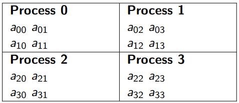

# Algorithm Explanation

<!-- toc -->

## Checkerboard

Most parallel matrix multiplication functions use a checkerboard distribution of the matrices. This means that the processes are viewed as a grid, and, rather than assigning entire rows or entire columns to each process, we assign small sub-matrices. For example, if we have four processes, we might assign the element of a 4x4 matrix as shown below, checkerboard mapping of a 4x4 matrix to four processes.

 

## Fox Algorithm

Fox‘s algorithm is a one that distributes the matrix using a checkerboard scheme like the above.

In order to simplify the discussion, lets assume that the matrices have order \\(n\\), and the number of processes, \\(p\\), equals \\(n^2\\). Then a checkerboard mapping assigns \\(a_{ij}\\), \\(b_{ij}\\) , and \\(c_{ij}\\) to process (\\(i\\), \\(j\\)).

Fox‘s algorithm takes \\(n\\) stages for matrices of order n one stage for each term aik bkj in the dot product 

\\(C_{i,j} = a_{i,0}b_{0,j} + a_{i,1}b_{1,i} +. . . +a_{i,n−1}b_{n−1,j}\\)

Initial stage, each process multiplies the diagonal entry of A in its process row by its element of B:

Stage \\(0\\) on process\\((i, j)\\): \\(c_{i,j} = a_{i,i} b_{i,j}\\)

Next stage, each process multiplies the element immediately to the right of the diagonal of A by the element of B directly beneath its own element of B:

Stage \\(1\\) on process\\((i, j)\\): \\(c_{i,j} = a_{i,i+1} b_{i+1,j}\\)

In general, during the kth stage, each process multiplies the element k columns to the right of the diagonal of A by the element \\(k\\) rows below its own element of B:

Stage \\(k\\) on process\\((i, j)\\): \\(c_{i,j} = a_{i,i+k} b_{i+k,j}\\)

## Example 2x2 Fox's Algorithm

Consider multiplying 2x2 block matrices \\(A\\), \\(B\\), \\(C\\):

\\[
\begin{aligned}
A \times B &= C \\\\
\begin{bmatrix}
1 & 1 \\\\
1 & 1 
\end{bmatrix}
\times
\begin{bmatrix}
1 & 1 \\\\
1 & 1 
\end{bmatrix}
&=
\begin{bmatrix}
2 & 2 \\\\
2 & 2 
\end{bmatrix}
\end{aligned}
\\]

**Stage 0:**

Process (i, i mod 2) | Broadcast along row i
--|--
(0,0) | \\(a_{00}\\)
(1,1) | \\(a_{11}\\)

\\[
\begin{bmatrix}
a_{00}, b_{00} & a_{00}, b_{01}\\\\
a_{11}, b_{10} & a_{11}, b_{11}\\\\
\end{bmatrix}
\\]

Process (\\(i\\), \\(j\\)) computes:

\\[
\begin{aligned}
C_{\text{Stage 0}}
\=
\begin{bmatrix}
1 \times 1 & 1 \times 1 \\\\
1 \times 1 & 1 \times 1 
\end{bmatrix}
&=
\begin{bmatrix}
1 & 1 \\\\
1 & 1 
\end{bmatrix}
\end{aligned}
\\]

Shift-rotate on the columns of \\(B\\)

**Stage 1:**

Process (\\(i\\), (\\(i\\) + 1) mod 2) | Broadcast along row \\(i\\)
--|--
(0,1) | \\(a_{01}\\)
(1,0) | \\(a_{10}\\)

\\[
\begin{matrix}
a_{01}, b_{10} & a_{01}, b_{11}\\\\
a_{10}, b_{00} & a_{10}, b_{01}\\\\
\end{matrix}
\\]

Process (\\(i\\), \\(j\\)) computes:

\\[
\begin{aligned}
C_{\text{Stage 1}}
\=
\begin{bmatrix}
1+1 \times 1 & 1+1 \times 1 \\\\
1+1 \times 1 & 1+1 \times 1 
\end{bmatrix}
&=
\begin{bmatrix}
2 & 2 \\\\
2 & 2 
\end{bmatrix}
\end{aligned}
\\]
