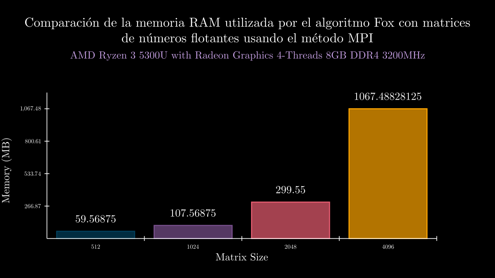

# Results

<!-- toc -->

## AMD Ryzen 5 3600 

### Characteristics

- 6 Core Processor 12 Threads 
- 16GB RAM DDR3
- Windows 11

### Float

#### Float Sequential Time

#### Float MPI Time

|exponent|time_mean            |memory_mean|t1                  |t2                  |t3                  |t4                   |t5                   |m1 |m2 |m3 |m4 |m5 |
|--------|---------------------|-----------|--------------------|--------------------|--------------------|---------------------|---------------------|---|---|---|---|---|
|6 MPI   |0.0030551800009561703|0.0        |0.003443099994910881|0.003591700005927123|0.002645799992023967|0.0024062000011326745|0.0031891000107862055|0.0|0.0|0.0|0.0|0.0|
|7 MPI   |0.012147580002783797 |0.0        |0.008701600003405474|0.007411400001728907|0.011636200011707842|0.012634700004127808 |0.020353999992948957 |0.0|0.0|0.0|0.0|0.0|
|8 MPI   |0.04785070000216365  |0.0        |0.06328279999434017 |0.06804290000582114 |0.04427630000282079 |0.031611700003850274 |0.032039800003985874 |0.0|0.0|0.0|0.0|0.0|
|9 MPI   |0.15007663999858778  |0.0        |0.14042419999896083 |0.14926969999214634 |0.17817379999905825 |0.13948559999698773  |0.14302990000578575  |0.0|0.0|0.0|0.0|0.0|
|10 MPI  |0.7285293200024171   |0.0        |0.7056575000024168  |0.7311181999975815  |0.7229602000006707  |0.741693200005102    |0.7412175000063144   |0.0|0.0|0.0|0.0|0.0|
|11 MPI  |4.220099439998739    |0.0        |4.461288599995896   |4.156596500004525   |4.157651299989084   |4.154624900009367    |4.170335899994825    |0.0|0.0|0.0|0.0|0.0|
|12 MPI  |30.01896587999945    |0.0        |29.88082619999477   |30.08790269999008   |30.047352100009448  |30.123827899995376   |29.954920500007574   |0.0|0.0|0.0|0.0|0.0|
|13 MPI  |236.6750523399969    |0.0        |237.7994949999993   |235.69214719999582  |236.10693409999658  |236.1462773999956    |237.63040799999726   |0.0|0.0|0.0|0.0|0.0|
|6 SEC   |0.02938175999734085  |0.0        |0.029565399992861785|0.028534299999591894|0.028825000001234002|0.030017799988854676 |0.029966300004161894 |0.0|0.0|0.0|0.0|0.0|
|7 SEC   |0.0688004399969941   |0.0        |0.06092390000412706 |0.061088000002200715|0.07383909999043681 |0.06472219999704976  |0.08342899999115616  |0.0|0.0|0.0|0.0|0.0|
|8 SEC   |0.2322037400008412   |0.0        |0.2795788000075845  |0.22014479999779724 |0.2378789000067627  |0.21173860000271816  |0.21167759998934343  |0.0|0.0|0.0|0.0|0.0|
|9 SEC   |0.9152549999998882   |0.0        |0.919658899991191   |0.9154974999983096  |0.9178280000051018  |0.9052672000107123   |0.9180233999941265   |0.0|0.0|0.0|0.0|0.0|
|10 SEC  |4.241440019998118    |0.0        |4.196437299993704   |4.21114800000214    |4.252561899993452   |4.347026300005382    |4.200026599995908    |0.0|0.0|0.0|0.0|0.0|
|11 SEC  |22.600311799999325   |0.0        |22.48826499999268   |22.77492300000449   |22.643439200008288  |22.542179099997156   |22.552752699994016   |0.0|0.0|0.0|0.0|0.0|
|12 SEC  |133.52642085999832   |0.0        |133.1521122999984   |133.94261509999342  |133.40880069999548  |133.72657189999882   |133.4020043000055    |0.0|0.0|0.0|0.0|0.0|
|13 SEC  |867.6051043400017    |0.0        |861.1038434999937   |863.3430384000094   |882.7370500000106   |865.974721999999     |864.8668677999958    |0.0|0.0|0.0|0.0|0.0|

### Integer

#### Integer Sequential Time

#### Integer MPI Time

|exponent|time_mean           |memory_mean|t1                   |t2                   |t3                  |t4                  |t5                  |m1 |m2 |m3 |m4 |m5 |
|--------|--------------------|-----------|---------------------|---------------------|--------------------|--------------------|--------------------|---|---|---|---|---|
|6 MPI   |0.002689300000201911|0.0        |0.0023728000014671125|0.0031310999984270893|0.003193299999111332|0.002304499997990206|0.002444800004013814|0.0|0.0|0.0|0.0|0.0|
|7 MPI   |0.008129080002254341|0.0        |0.007357000002230052 |0.007035200003883801 |0.010785200000100303|0.007353400003921706|0.008114600001135841|0.0|0.0|0.0|0.0|0.0|
|8 MPI   |0.029078160000790377|0.0        |0.03505410000070697  |0.02448770000046352  |0.02802230000088457 |0.028654599998844787|0.029172100003052037|0.0|0.0|0.0|0.0|0.0|
|9 MPI   |0.14346503999840934 |0.0        |0.13513329999841517  |0.1567471999951522   |0.1323597000009613  |0.14503549999790266 |0.14804949999961536 |0.0|0.0|0.0|0.0|0.0|
|10 MPI  |0.7103064599999925  |0.0        |0.7079091999985394   |0.7368706999986898   |0.7045027999993181  |0.7158186000015121  |0.6864310000019032  |0.0|0.0|0.0|0.0|0.0|
|11 MPI  |4.197381619999942   |0.0        |4.1438114999982645   |4.2107729999988806   |4.155224800000724   |4.293355500005418   |4.183743299996422   |0.0|0.0|0.0|0.0|0.0|
|12 MPI  |29.897894040001848  |0.0        |30.06699220000155    |30.016745799999626   |29.889804500002356  |29.83930820000387   |29.676619500001834  |0.0|0.0|0.0|0.0|0.0|
|13 MPI  |235.11144704000034  |0.0        |236.3504993000024    |234.47165250000398   |233.7182845999996   |233.5796835000001   |237.43711529999564  |0.0|0.0|0.0|0.0|0.0|
|6 SEC   |0.029282880001119338|0.0        |0.030714400003489573 |0.029131399998732377 |0.029304000003321562|0.028636000002734363|0.028628599997318815|0.0|0.0|0.0|0.0|0.0|
|7 SEC   |0.060333499999251215|0.0        |0.06073800000012852  |0.05998159999580821  |0.06019219999870984 |0.060492800002975855|0.06026289999863366 |0.0|0.0|0.0|0.0|0.0|
|8 SEC   |0.20414460000320106 |0.0        |0.20137200000317534  |0.2014608000026783   |0.20306750000600005 |0.2043989000012516  |0.21042380000289995 |0.0|0.0|0.0|0.0|0.0|
|9 SEC   |0.8934796200017445  |0.0        |0.8970133000038913   |0.8909725000048638   |0.8946256999988691  |0.8927302000010968  |0.8920564000000013  |0.0|0.0|0.0|0.0|0.0|
|10 SEC  |4.099762219999684   |0.0        |4.0990553999945405   |4.08489499999996     |4.108394100003352   |4.1030172999962815  |4.103449300004286   |0.0|0.0|0.0|0.0|0.0|
|11 SEC  |22.42618649999931   |0.0        |22.355210499998066   |22.41438790000393    |22.40389960000175   |22.536025899993547  |22.421408599999268  |0.0|0.0|0.0|0.0|0.0|
|12 SEC  |133.9727838799983   |0.0        |134.05730229999608   |133.69151380000403   |134.34823799999867  |134.0702519999977   |133.69661329999508  |0.0|0.0|0.0|0.0|0.0|
|13 SEC  |868.0411636400022   |0.0        |864.2142595000041    |865.9321351000035    |870.7643005000064   |871.6217934000015   |867.6733296999955   |0.0|0.0|0.0|0.0|0.0|

## AMD Ryzen 3 5300U with Radeon Graphics

### Characteristics

- 4 Threads
- 8 GB RAM
- Ubuntu 20.01 LTS

### Float

#### Float Sequential Time

#### Float Sequential Memory

#### Float MPI Time

#### Float MPI Memory

|exponent|time_mean           |memory_mean|t1                   |t2                   |t3                  |t4                  |t5                  |m1 |m2 |m3 |m4 |m5 |
|--------|--------------------|-----------|---------------------|---------------------|--------------------|--------------------|--------------------|---|---|---|---|---|
|6 MPI   |0.006882413999846904|44827.2    |0.00616076799997245  |0.007571267999992415 |0.009120849999817437|0.005788312999357004|0.005770871000095212|44516.0|44976.0|44856.0|44984.0|44804.0|
|7 MPI   |0.026216812000348   |45505.6    |0.0235308890005399   |0.03057239500049036  |0.030295870999907493|0.023232615000779333|0.023452290000022913|45340.0|45380.0|45916.0|45408.0|45484.0|
|8 MPI   |0.07103344159986591 |48777.6    |0.0644259669998064   |0.07458897000014986  |0.06409100400014722 |0.08247323999967193 |0.06958802699955413 |48832.0|48752.0|48840.0|48740.0|48724.0|
|9 MPI   |0.31519364760006285 |60998.4    |0.3090453289996731   |0.3105386739998721   |0.323262332000013   |0.328039964000709   |0.305081939000047   |60808.0|61292.0|61040.0|61132.0|60720.0|
|10 MPI  |1.9657097786001032  |110150.4   |1.956600716000139    |1.972460088999469    |1.967714929000067   |1.963982125000257   |1.9677910340005837  |110216.0|110316.0|109880.0|110424.0|109916.0|
|11 MPI  |15.086349821199837  |306739.2   |15.097831608999513   |15.06219048300045    |15.081034732999797  |15.11948033599947   |15.071211944999959  |306568.0|306676.0|306928.0|306700.0|306824.0|
|12 MPI  |118.09601411939984  |1093108.0  |117.49792914299996   |117.55301655800031   |117.4915157659998   |120.29619238499981  |117.64141674499933  |1093068.0|1093104.0|1093056.0|1093292.0|1093020.0|
|6 SEC   |0.02014490380006464 |134108.0   |0.020155482000518532 |0.02016766499946243  |0.02030808099971182 |0.0196520090003105  |0.020441282000319916|134108.0|134108.0|134108.0|134108.0|134108.0|
|7 SEC   |0.050219269600347616|134108.0   |0.04954443600036029  |0.04997883800024283  |0.051060316000075545|0.05030692000036652 |0.05020583800069289 |134108.0|134108.0|134108.0|134108.0|134108.0|
|8 SEC   |0.17468092960007198 |134108.0   |0.1734118699996543   |0.17380072599917185  |0.1739819490003356  |0.17596849800065684 |0.1762416050005413  |134108.0|134108.0|134108.0|134108.0|134108.0|
|9 SEC   |0.8327643823999097  |134108.0   |0.8214600789997348   |0.8339379310000368   |0.8375314009999784  |0.8423835240000699  |0.8285089769997285  |134108.0|134108.0|134108.0|134108.0|134108.0|
|10 SEC  |4.5236622611999335  |134108.0   |4.504509599000812    |4.53639165200002     |4.517755044999831   |4.536735672999384   |4.522919336999621   |134108.0|134108.0|134108.0|134108.0|134108.0|
|11 SEC  |25.990362968200134  |134108.0   |26.099206627000058   |26.0074372450008     |26.028763903000254  |25.8560191459992    |25.960387920000358  |134108.0|134108.0|134108.0|134108.0|134108.0|
|12 SEC  |168.52421300860004  |426997.6   |168.4287555890005    |167.8469278450002    |168.67190678299994  |169.53767954900013  |168.1357952769995   |426988.0|426992.0|426944.0|426948.0|427116.0|

### Integer

#### Integer Sequential Time

#### Integer Sequential Memory

#### Integer MPI Time

#### Integer MPI Memory

|exponent|time_mean           |memory_mean|t1                   |t2                   |t3                  |t4                  |t5                  |m1 |m2 |m3 |m4 |m5 |
|--------|--------------------|-----------|---------------------|---------------------|--------------------|--------------------|--------------------|---|---|---|---|---|
|6 MPI   |0.0055051958000149  |44852.0    |0.0031517399997937   |0.0057380630000807   |0.0057468400000288  |0.0040065170001071  |0.008882819000064   |44136.0|44744.0|45052.0|45140.0|45188.0|
|7 MPI   |0.0272898420001183  |45420.8    |0.0231502470001032   |0.0234150100000078   |0.0292151310000008  |0.0348449370003436  |0.0258238850001362  |45544.0|44824.0|45760.0|45392.0|45584.0|
|8 MPI   |0.0739616388000286  |48340.0    |0.0729102610002883   |0.0811236619997544   |0.0858247690002826  |0.0632901849999143  |0.0666593169999032  |48452.0|48448.0|47740.0|48440.0|48620.0|
|9 MPI   |0.3239013899999918  |60753.6    |0.3350273999999444   |0.3262528649997875   |0.3130012500000703  |0.3336551950001194  |0.3115702400000373  |60692.0|60584.0|60768.0|60932.0|60792.0|
|10 MPI  |1.9734662450000544  |109984.8   |1.9745565680000248   |1.973893446000148    |1.9708118759999709  |1.969781122999848   |1.97828821200028    |109884.0|110200.0|109584.0|110072.0|110184.0|
|11 MPI  |15.107547805800005  |306612.8   |15.11717991200021    |15.073204916999655   |15.11073724500011   |15.112203008000051  |15.124413946999994  |306548.0|306824.0|306568.0|306516.0|306608.0|
|12 MPI  |117.22914520040013  |1093093.6  |117.3144714          |117.3090739270001    |117.34079946900056  |117.31188550499974  |116.86949570100025  |1093016.0|1092912.0|1093332.0|1093060.0|1093148.0|
|6 SEC   |0.0196059197999602  |90328.0    |0.0189724369997748   |0.0196790810000493   |0.020375796999815   |0.0194069730000592  |0.0195953110001028  |90328.0|90328.0|90328.0|90328.0|90328.0|
|7 SEC   |0.0492170399999849  |90328.0    |0.0483742010001151   |0.0493801659999917   |0.0493045709999933  |0.0496616390000781  |0.0493646229997466  |90328.0|90328.0|90328.0|90328.0|90328.0|
|8 SEC   |0.1744864736000636  |90328.0    |0.1772551020003447   |0.1733394259999841   |0.1735761519998959  |0.1739198039999792  |0.174341884000114   |90328.0|90328.0|90328.0|90328.0|90328.0|
|9 SEC   |0.8318701096001859  |90328.0    |0.8306139000001167   |0.8401869850004005   |0.8381296229999862  |0.8236760620002315  |0.8267439780001951  |90328.0|90328.0|90328.0|90328.0|90328.0|
|10 SEC  |4.520915783400051   |90328.0    |4.518278625000221    |4.515260805999787    |4.517735109000114   |4.488614104000135   |4.5646902729999965  |90328.0|90328.0|90328.0|90328.0|90328.0|
|11 SEC  |26.019327671799875  |131990.4   |25.927749363999737   |25.88356371500004    |25.887511626000105  |26.452818032999858  |25.944995620999634  |131952.0|131952.0|131952.0|132144.0|131952.0|
|12 SEC  |169.48952086539992  |426860.8   |167.03305509500024   |169.1147969169997    |168.76519542999995  |176.81053264399998  |165.72402424099982  |426904.0|426864.0|426868.0|426860.0|426808.0|
