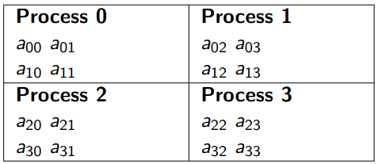

# Algorithm Explanation

<!-- toc -->

## Checkerboard

Most parallel matrix multiplication functions use a checkerboard distribution of the matrices. This means that the processes are viewed as a grid, and, rather than assigning entire rows or entire columns to each process, we assign small sub-matrices. For example, if we have four processes, we might assign the element of a 4x4 matrix as shown below, checkerboard mapping of a 4x4 matrix to four processes.

 

## Fox Algorithm

Fox‘s algorithm is a one that distributes the matrix using a checkerboard scheme like the above.

In order to simplify the discussion, lets assume that the matrices have order \\(n\\), and the number of processes, \\(p\\), equals \\(n^2\\). Then a checkerboard mapping assigns \\(a_{ij}\\), \\(b_{ij}\\) , and \\(c_{ij}\\) to process (\\(i\\), \\(j\\)).

Fox‘s algorithm takes n stages for matrices of order n one stage for each term aik bkj in the dot product 

Cij = ai0b0j + ai1b1i +. . . +ai,n−1bn−1,j

Initial stage, each process multiplies the diagonal entry of A in its process row by its element of B:

Stage 0 on process(i, j): cij = aii bij

Next stage, each process multiplies the element immediately to the right of the diagonal of A by the element of B directly beneath its own element of B:

Stage 1 on process(i, j): cij = cij + ai,i+1bi+1,j

In general, during the kth stage, each process multiplies the element k columns to the right of the diagonal of A by the element k rows below its own element of B:

Stage k on process(i, j): cij = cij + ai,i+k bi+k,

## Example 3x3 Fox's Algorithm

